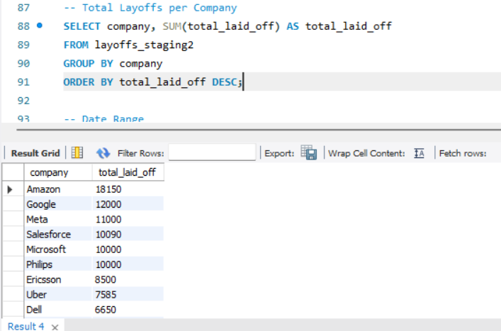
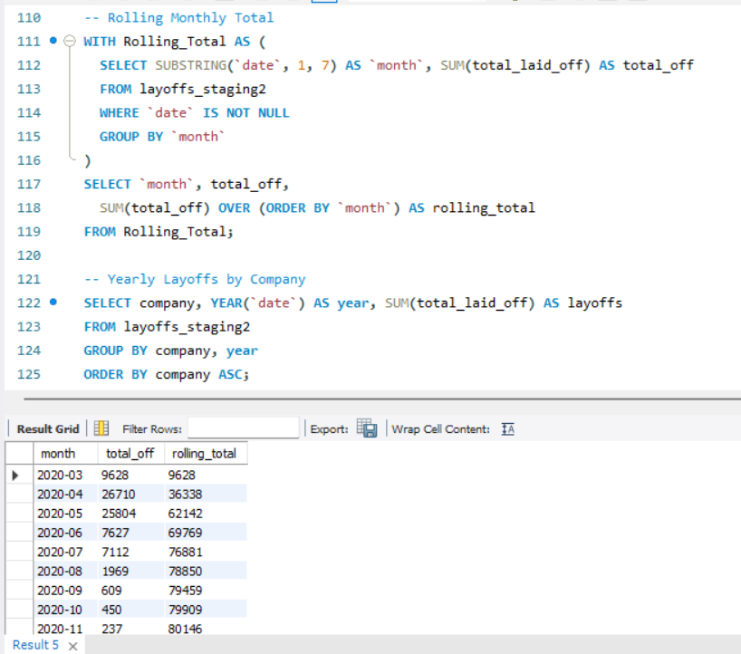

# sql-layoffs-analysis
Data cleaning and exploratory analysis of global layoffs using MySQL
# SQL Project – Layoffs Data Cleaning & Analysis

This project focuses on cleaning and analyzing a global layoffs dataset using SQL. The goal was to transform raw data into a clean and structured format for insights. The dataset includes layoff events across different companies, industries, and countries.

---

## 📁 Dataset

- **Source**: [Layoffs Dataset – Kaggle](https://www.kaggle.com/code/pranaii/layoffs-2022-interactive-visualisation-eda)
- **Database Used**: `world_layoffs`
- **Original Table**: `layoffs`
- **Staging Table**: `layoffs_staging2`

---

## 🔧 Tools & Technologies

- MySQL
- MySQL Workbench
- GitHub
- Power Bi

---

## 🔄 Process Summary

### 1. Data Preparation
- Created a **staging table** from the original `layoffs` table to preserve raw data
- Inserted all data into `layoffs_staging`

### 2. Duplicate Removal
- Used `ROW_NUMBER()` with `PARTITION BY` to identify duplicates
- Deleted all rows where `row_num > 1`

### 3. Standardizing and Cleaning
- Trimmed whitespace from `company` names
- Replaced inconsistent values (e.g., `"United States."` → `"United States"`, `Crypto`, etc.)
- Converted the `date` column from `TEXT` to proper `DATE` format using `STR_TO_DATE()`

### 4. Handling Missing Values
- Replaced empty `industry` values by referencing other rows of the same company
- Deleted rows where both `total_laid_off` and `percentage_laid_off` were null

### 5. Dropping Unnecessary Columns
- Removed the `row_num` column after cleaning

---

## 📊 Exploratory SQL Queries Performed

- Total layoffs by company
- Layoffs over time by year/month
- Companies with 100% layoff rate
- Total layoffs by year
- Rolling total layoffs over time using window functions
- Min and max dates of layoffs
- Industry-based and country-based breakdowns

---

## 📌 Key SQL Concepts Used

- `ROW_NUMBER()` and `OVER(PARTITION BY...)`
- Common Table Expressions (CTEs)
- `JOIN` operations
- `GROUP BY`, `ORDER BY`, `WHERE`, `HAVING`
- `STR_TO_DATE()` for date conversion
- `UPDATE`, `DELETE`, `ALTER`, and `TRIM` functions

---
## 📊 Power BI Dashboard

After cleaning, the data was exported as CSV and loaded into **Power BI** for visualization.

### 🔧 Tools Used:
- Bar Chart (Top Companies by Layoffs)
- Line Chart (Monthly Layoff Trend)
- Map Visual (Layoffs by Country)
- Slicers for interactivity

---

## 📈 Sample Visuals

### 🔹 Top 10 Companies by Layoffs

### 🔹 Monthly Layoff Trend

---

## 🧠 Learnings

- Real-world data is often messy and requires multiple cleaning steps
- Importance of staging tables for safe data transformation
- SQL is effective for both cleaning and deriving early insights
- Handling nulls and inconsistencies improves analysis accuracy

---

---

## 📎 Dataset Source

- Dataset: [Layoffs Dataset on Kaggle](https://www.kaggle.com/code/pranaii/layoffs-2022-interactive-visualisation-eda)
